<a name="Table of Contents"></a>

## Table of Contents

- [Table of Contents](#table-of-contents)
- [System Overview](#system-overview)
- [System Components](#system-components)
  - [1. Frontend](#1-frontend)
  - [2. Backend](#2-backend)
  - [3. Database](#3-database)
  - [4. External API Usage](#4-external-api-usage)
    - [ Google Maps API](#-google-maps-api)
    - [ Open Library API](#-open-library-api)
    - [ YAddress API](#-yaddress-api)
- [System Architecture](#system-architecture)
  - [1. Presentation Layer](#1-presentation-layer)
  - [2. Application Layer](#2-application-layer)
  - [3. Data Layer](#3-data-layer)
  - [4. Integration Layer](#4-integration-layer)
- [System Features](#system-features)
  - [1. Book Management](#1-book-management)
  - [2. User Management](#2-user-management)
  - [3. Book Checkout](#3-book-checkout)
  - [4. Review and Rating System](#4-review-and-rating-system)
- [Installation and Setup](#installation-and-setup)
  - [Required downloads](#required-downloads)
  - [PostgreSQL Database Setup](#postgresql-database-setup)
  - [Clone the Repository](#clone-the-repository)
  - [Navigate to the Project Directory](#navigate-to-the-project-directory)
  - [Running the Frontend](#running-the-frontend)
  - [Running the Backend](#running-the-backend)
- [Getting Started](#getting-started)
- [API Documentation](#api-documentation)
- [Application Walkthrough](#application-walkthrough)

<a name="System Overview"></a>

## System Overview

Our decentralized library system is a web-based application that allows users to access a database of books and interact with other users. Our system enables users to leave reviews and ratings for books, check out physical copies of books, and facilitates the transfer of books between users. We utilize ReactJS for the frontend, Java for the backend, the Google Maps API, and PostgreSQL for the database management.

<a name="System Components"></a>

## System Components

<a name="frontend"></a>

### 1. Frontend

- ReactJS: We will utilize ReactJS to develop a responsive and user-friendly frontend interface. It will handle user interactions, display book information, reviews, and provide a seamless experience for our users.

<a name="backend"></a>

### 2. Backend

- Java: We will use Java as the backend programming language to handle the business logic of our application.

<a name="database"></a>

### 3. Database

- PostgreSQL: We will utilize PostgreSQL as the database management system to store information about books, users, and book reviews.

<a name="External API Usage"></a>

### 4. External API Usage

#### <div align="center"> Google Maps API

The Google Maps API is leveraged to identify the nearest physical book to the requesting user. This API helps us pinpoint the current location of the users and the books, making it easier to facilitate the transfer of physical books between users. You can find more about this API at the [Google Maps Platform](https://mapsplatform.google.com/).

#### <div align="center"> Open Library API

The [Open Library API](https://openlibrary.org/developers/api) is a freely accessible API that allows us to fetch detailed book information such as author, publication date, genre, and book summary among others. We utilize this API to ensure that the book data we present to our users is valid, accurate, and up-to-date. The Open Library API plays a crucial role in our Book Management feature, enabling users to search and view comprehensive book details.

#### <div align="center"> YAddress API

The [YAddress API](https://www.yaddress.net/WebApi) is used for verifying and standardizing the addresses provided by our users. This API assists us in ensuring that the user's location data is accurate, which is critical for our service as we rely on precise user locations to facilitate the transfer of physical books. The YAddress API takes a user's provided address, verifies its validity, and returns a standardized version of the address that ensures consistency in our database and improves the accuracy of the location data we use with the Google Maps API.

## System Architecture

Our decentralized library system follows a client-server architecture, where the frontend interacts with the backend to retrieve and manipulate data stored in the database. The Google Maps API is utilized for location tracking and book availability.

The system architecture can be divided into the following layers:

<a name="Presentation Layer"></a>

### 1. Presentation Layer

- User Interface: We will develop an intuitive and user-friendly interface using ReactJS, allowing our users to browse books, leave reviews, and perform various actions.
- User Authentication: We will implement a secure login and registration system to authenticate our users.

<a name="Application Layer"></a>

### 2. Application Layer

- Backend Services: We will implement Java-based backend services to handle user requests, manage book transactions, and interact with the database.
- Data Validation: We will implement robust validation logic to ensure data integrity and prevent unauthorized access.

<a name="Data Layer"></a>

### 3. Data Layer

- Database: We will utilize PostgreSQL as the database management system to store and retrieve data related to books, users, reviews, and transactions.
- Database Schema: We will design an efficient database schema that represents entities such as books, users, reviews, and establish appropriate relationships between them.

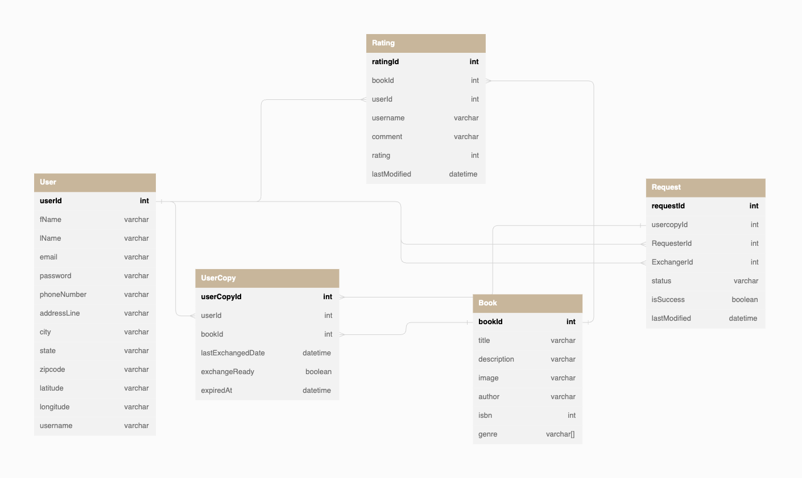

<a name="Integration Layer"></a>

### 4. Integration Layer

- Google Maps API Integration: We will integrate the Google Maps API to identify the nearest physical book to the requesting user.
- API Communication: We will implement RESTful APIs to facilitate communication between the frontend and backend components.

## System Features

<a name="Book Management"></a>

### 1. Book Management

- Store book information such as title, author, genre, and availability in the database.
- Allow users to search, filter, and view book details.
- Enable users to leave reviews and ratings for books.

<a name="User Management"></a>

### 2. User Management

- Maintain user profiles with information such as name, contact details, and history.
- Implement user registration and authentication mechanisms.
- Provide user roles (e.g., admin, regular user) to manage system access and privileges.

<a name="Book Checkout"></a>

### 3. Book Checkout

- Identify the nearest physical book to the requesting user using the Google Maps API.
- Facilitate book transfer between users by updating the book's ownership in the database.
- Enforce a two-week waiting period before a checked-out book can be checked out again.

<a name="Review and Rating System"></a>

### 4. Review and Rating System

- Enable users to leave reviews and ratings for books.
- Implement a rating system that aggregates user ratings and displays an average rating for each book.

<a name="Installation and Setup"></a>

## Installation and Setup

<a name="Required downloads"></a>

### Required downloads

- Java 17
- Spring-boot
- Maven
- PostgreSQL
- Node.js
- NPM

<a name="PostgreSQL Database Setup"></a>

### PostgreSQL Database Setup

Before you start, make sure you have PostgreSQL installed on your system. If not, download and install it from the official [the official PostgreSQL site](https://www.postgresql.org/download/).

To set up the "librashare" PostgreSQL database, follow these steps:

1. Open your command line interface and start PostgreSQL with the psql command.
2. Create the "librashare" database with this command:
   ```
   CREATE DATABASE librashare;
   ```
3. Connect to the new database with this command:
   ```
   \c librashare
   ```

Now, you're ready to use your "librashare" database.

<a name="Clone the Repository"></a>

### Clone the Repository

```
git clone https://github.com/crhomere/LibraShare.git
```

<a name="Navigate to the Project Directory"></a>

### Navigate to the Project Directory

```
cd LibraShare
```

<a name="Running the Frontend"></a>

### Running the Frontend

1. open a new terminal
2. Navigate to frontend directory

```
cd libra-share-frontend/
```

Install dependencies: Navigate to your project directory in the terminal and run the following command to install the project dependencies

```
npm install

```

Start the application: Start the React application by running

```
npm start

```

<a name="Running the Backend"></a>

### Running the Backend

Open a new terminal (do not close the terminal running the frontend)

Build the application: Navigate to your backend project directory in the terminal and run the following command to build the application

```
mvn clean install

```

Start the application: Start the Spring Boot application by running

```
mvn spring-boot:run

```

<a name="Getting Started"></a>

## Getting Started

Now Librashare should be accessible from [port 8080](http://localhost:8080)

<a name="API Documentation"></a>

## API Documentation

Here is a brief overview of the API endpoints available:

| Method   | URL                                | Description               |
| -------- | ---------------------------------- | ------------------------- |
| `POST`   | `/users/register`                  | Register user             |
| `POST`   | `/users/login`                     | Login user                |
| `POST`   | `/books/{book id}/add`             | Create book               |
| `PUT`    | `/books/{book id}`                 | Update book               |
| `DELETE` | `/books/{book id)`                 | Delete book               |
| `GET`    | `/books/all`                       | Get all books             |
| `GET`    | `/books/{book id}`                 | Get book by id            |
| `POST`   | `/ratings/{user id}/{book id}/add` | Add rating                |
| `GET`    | `/ratings/user/{user id}/all`      | Get all ratings from user |
| `GET`    | `/ratings/book/{book id}/all`      | Get all ratings from book |
| `GET`    | `/ratings/{rating id}`             | Get rating by id          |
| `PUT`    | `/ratings/{rating id}`             | Update rating             |
| `DELETE` | `/ratings/{rating id}`             | Delete rating             |
| `GET`    | `/books/{title}}`                  | Get book by title         |
| `GET`    | `/books/zipcode/{zip code}`        | Get books by zip code     |
| `GET`    | `/books/user/{user id}`            | Get books by user         |
| `GET`    | `/books/{isbn}`                    | Get book by ISBN          |

<a name="Application Walkthrough"></a>

## Application Walkthrough

Home page: The prominently placed "Enter Library" button invites users to delve into the library's collections and resources.


Welcome page: Entry into the librashare app utilizing register for new users or log in features for existing users.

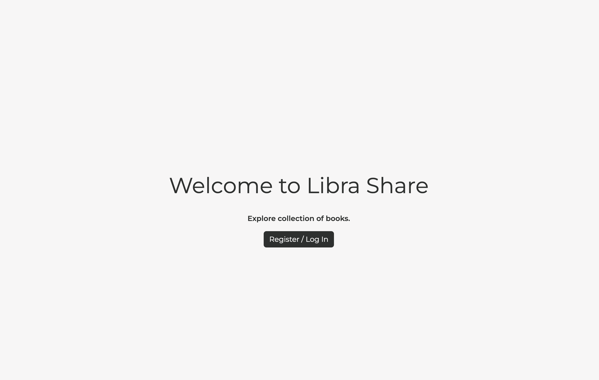

Register page: New users are able to register for Librashare.

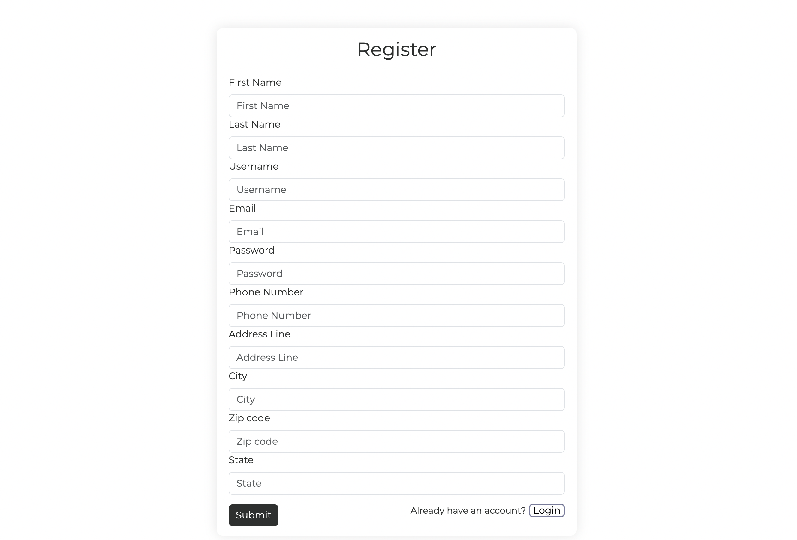

Log In page: Existing users are able to log into Librashare.

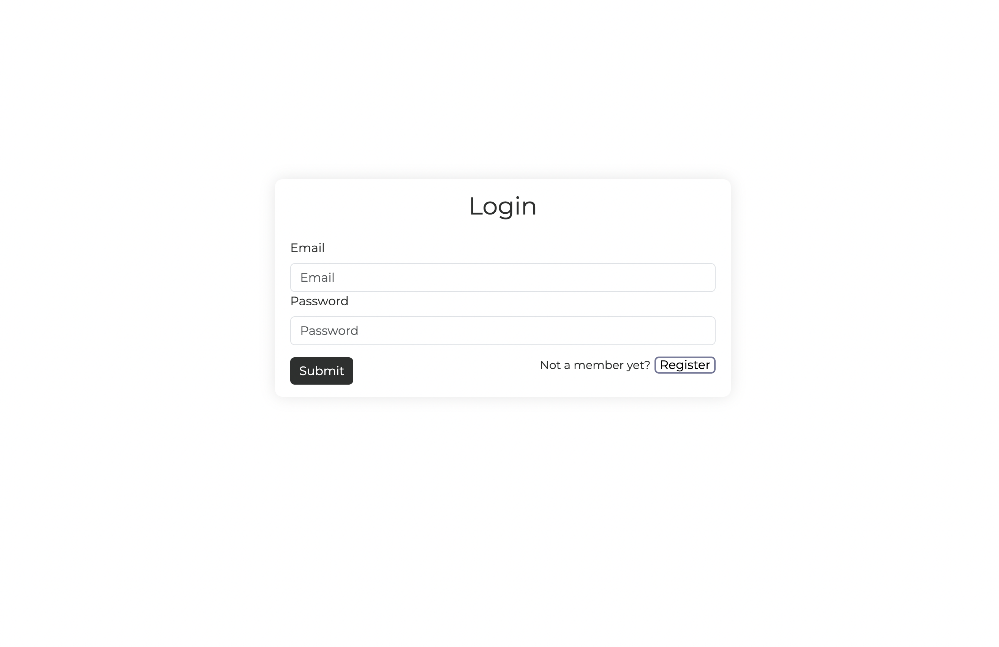

Here we demonstrate that if a book with the same title as the one the logged-in user has is available for exchange, the option to exchange will be disabled for that user.

<p float="left">
  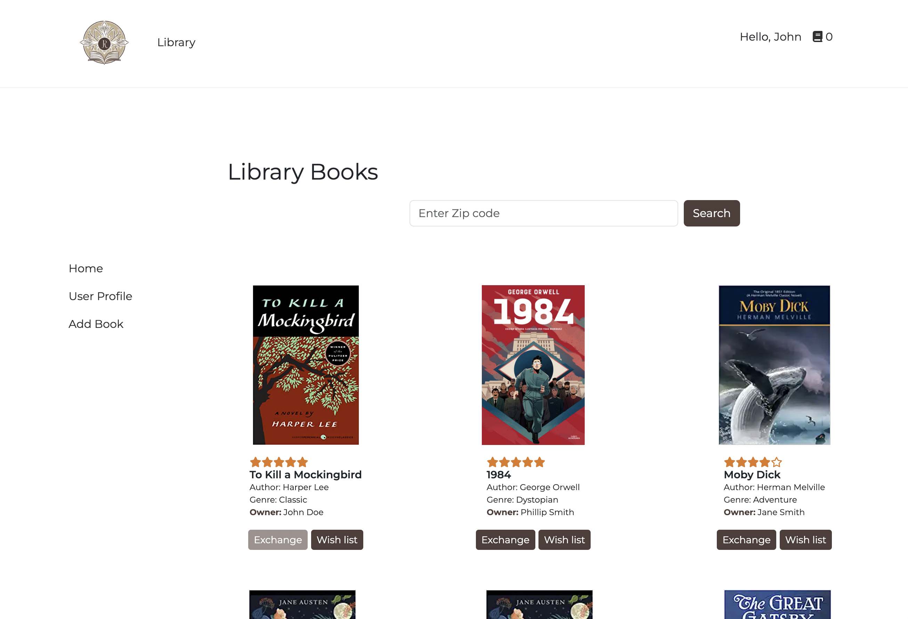 ->
  
</p>

Ratings and review: Users can add ratings and reviews for books.

<p float="left">
  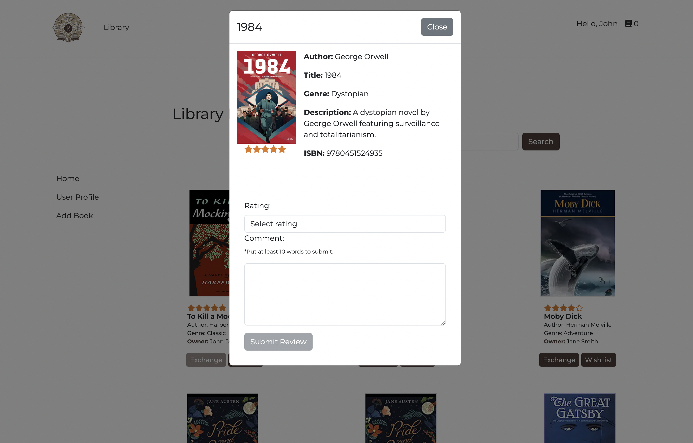 ->
  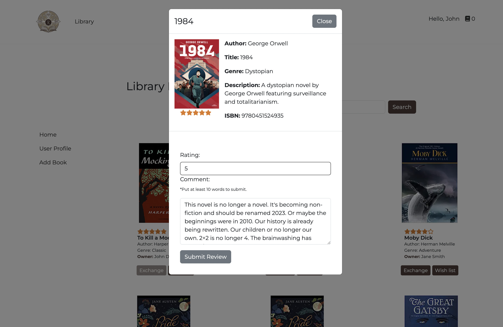
</p>

CRUD functionalities for books, book information, and user rating.

<p float="left">
  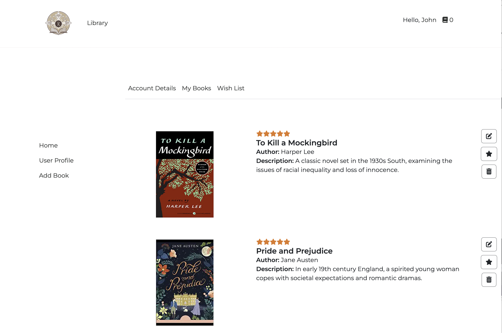
  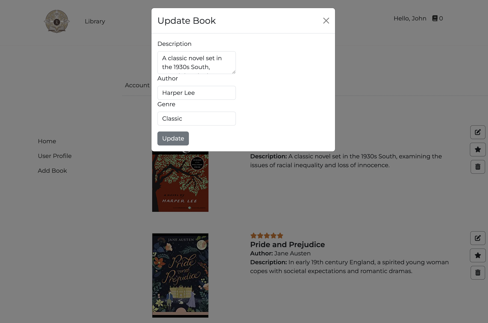
  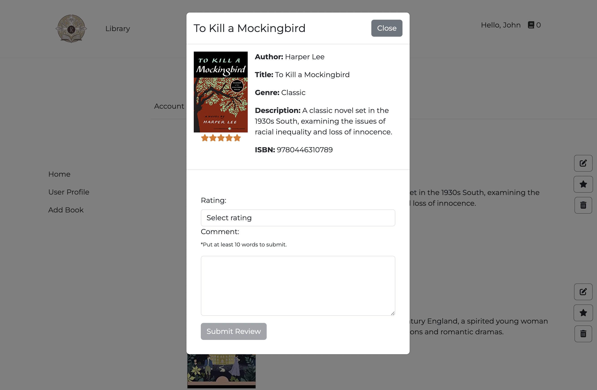 
</p>

Account page: Users can view their personal user dashboard.

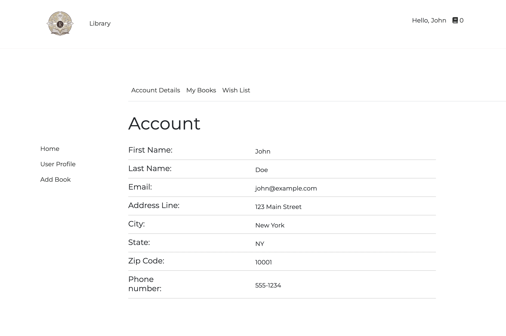

Error page: Error handling page to notify users of a broken link.


